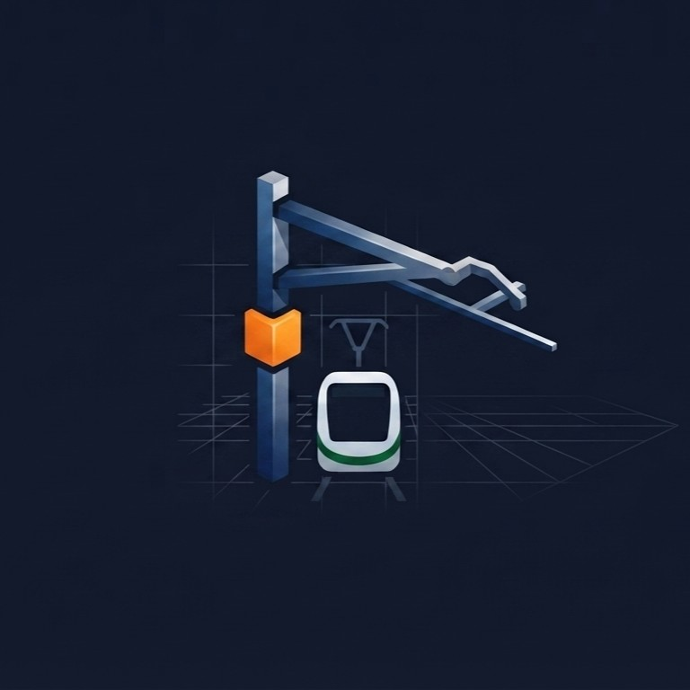
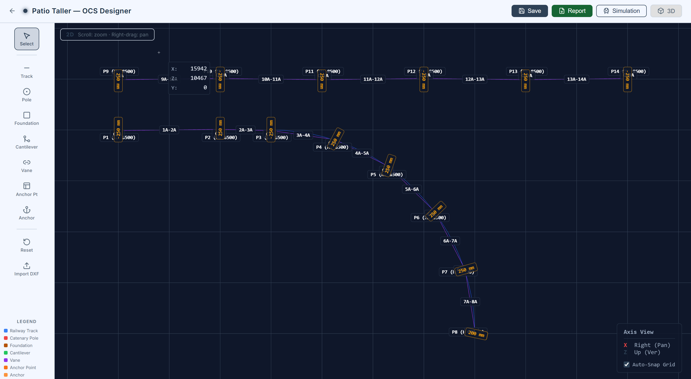
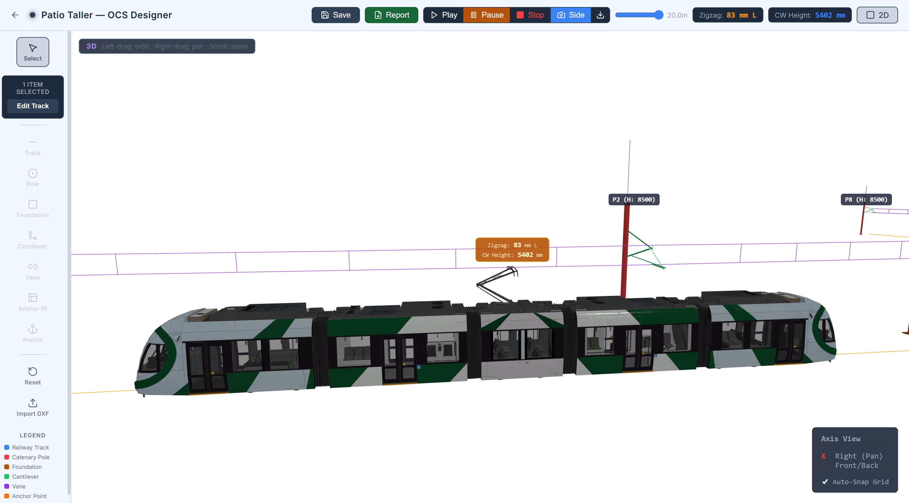
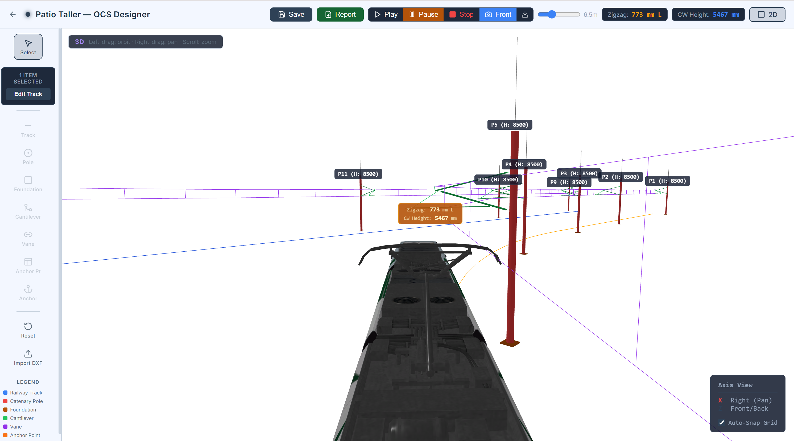
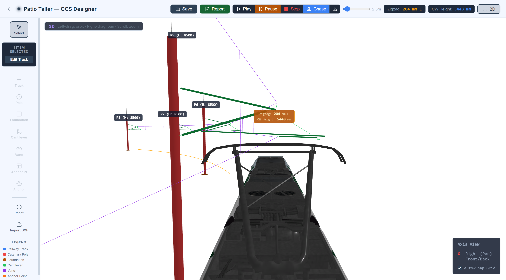

<p align="center">
  
</p>

<h1 align="center">OCS — Overhead Contact System Design Platform</h1>

<p align="center">
  <strong>Open-source engineering platform for designing, calculating, and simulating railway overhead contact line systems.</strong>
</p>

<p align="center">
  <a href="#features">Features</a> •
  <a href="#architecture">Architecture</a> •
  <a href="#the-calculator">The Calculator</a> •
  <a href="#simulation">Simulation</a> •
  <a href="#getting-started">Getting Started</a> •
  <a href="#roadmap">Roadmap</a> •
  <a href="#license">License</a> •
  <a href="#contact">Contact</a>
</p>

---

## Demo

<!-- Replace the link below with the URL to your video (YouTube, Vimeo, etc.) -->
<p align="center">
  <a href="https://your-video-url-here">
    
  </a>
</p>

<p align="center"><em>Click the image above to watch the demo video</em></p>

---

## Screenshots

<!-- Place your four screenshots in docs/images/ and update the filenames below -->

<p align="center">
  
  
</p>
<p align="center">
  
  
</p>

---

## What is OCS?

**OCS** is a full-stack engineering platform purpose-built for the design, geometric calculation, and real-time simulation of **railway Overhead Contact Line (OCL) systems** — also known as catenary systems.

Overhead contact systems are the electrification infrastructure that powers electric trains. They consist of **tracks**, **foundations**, **poles**, **cantilevers** (the mechanical arms that hold the wires), **vanes** (catenary spans with contact wire, messenger wire, and droppers), and **anchoring** systems. Designing these systems correctly requires precise geometric calculations, strict adherence to clearance envelopes, and careful coordination between civil and electrical engineering.

Traditional OCS design is done with spreadsheets, disconnected CAD tools, and manual calculations. **OCS changes this** by providing:

- 📐 **A visual 2D/3D editor** where engineers draw tracks (straight and curved), place poles and foundations, attach cantilevers, and string vanes — all in a unified interface.
- ⚙️ **A high-performance C++ calculation engine** that solves cantilever geometry and vane catenary physics in real time via WebSocket, producing precise cut lists and 3D assembly coordinates.
- 🚆 **A built-in train simulation** that lets engineers visualize how the pantograph interacts with the contact wire — checking zigzag, contact wire height, and clearances dynamically as the train traverses the track.
- 🌐 **A collaborative web platform** with multi-user project management, role-based access, and real-time calculation streaming.

---

## Features

### Visual Editor
- **2D Plan View** — Draw tracks with polyline or arc segments, place foundations, poles, and cantilevers with snap-to-track precision.
- **3D Perspective View** — See the full catenary assembly rendered in Three.js with proper elevations, dropper positions, and wire sag.
- **DXF Import** — Import existing AutoCAD track layouts directly into the editor.
- **Element Panels** — Configure every parameter of each element (pole height, cantilever reach, zigzag offset, contact wire height, system height, dropper count, tensions, etc.) through dedicated side panels.

### Real-Time Calculation Engine
- **Cantilever Geometry** — Given a pole position and track foot, the C++ engine computes the full 3D assembly: steady arm, stay tube, bracket tube, register arm, reinforcements, and all cut lengths.
- **Vane Catenary Physics** — Calculates messenger wire and contact wire profiles, dropper lengths, sag, and attachment coordinates for each span.
- **WebSocket Streaming** — Calculations are triggered on parameter change and streamed back to the browser in real time via STOMP over WebSocket. No page refreshes, no waiting.

### Train Simulation
- **Track-following simulation** — A virtual train traverses any selected track with play/pause/stop controls.
- **Real-time Zigzag** — The lateral offset between the pantograph center and the contact wire is calculated geometrically by intersecting the pantograph plane with the vane contact wire segments.
- **Contact Wire Height** — The CW height at the pantograph is displayed live using inverse-distance-weighted interpolation from nearby cantilevers.
- **Chase Cam & Free Cam** — Follow the train from behind with adjustable zoom, or orbit freely to inspect from any angle.
- **Snapshot Export** — Pause the simulation and download a PNG screenshot (including all labels) at any time.

### Platform
- **Multi-project management** — Create and manage multiple locations within a project.
- **User authentication** — JWT-based login with role management (Admin / User).
- **Scene persistence** — All geometry is saved as JSON and can be reloaded, shared, or versioned.

---

## Architecture

OCS is a **monorepo** with four main services, orchestrated via Docker Compose:

```
┌─────────────────────────────────────────────────────────┐
│                     ocs (monorepo)                       │
│                                                         │
│  ┌──────────┐    ┌──────────┐    ┌──────────────────┐   │
│  │ ocs-web  │◄──►│ ocs-api  │◄──►│ ocs-calculator   │   │
│  │ React +  │    │ Spring   │    │ C++ Engine        │   │
│  │ Three.js │    │ Boot     │    │ (WebSocket)       │   │
│  │ Vite     │    │ REST +   │    │                   │   │
│  │          │    │ STOMP WS │    │ Cantilever solver │   │
│  └──────────┘    └────┬─────┘    │ Vane solver       │   │
│                       │          └──────────────────┘   │
│                  ┌────┴─────┐                           │
│                  │ Postgres │                           │
│                  │ 16       │                           │
│                  └──────────┘                           │
└─────────────────────────────────────────────────────────┘
```

| Service | Tech Stack | Description |
|---|---|---|
| **ocs-web** | React 18, TypeScript, Three.js, Vite | 2D/3D visual editor, simulation, and project UI |
| **ocs-api** | Java 21, Spring Boot, Liquibase, STOMP | REST API, authentication, WebSocket proxy, database |
| **ocs-calculator** | C++17, CMake | Geometric solver for cantilevers and vane catenaries |
| **postgres** | PostgreSQL 16 | Persistent storage for users, projects, locations |

---

## The Calculator

The heart of OCS is the **C++ calculation engine** (`ocs-calculator`). It is a modular, Entity-Component library that geometrically solves the full 3D assembly of overhead contact line components.

### What It Calculates Today

**Cantilever Assembly Geometry:**
Given a pole position, a track foot, contact wire height, system height, and zigzag offset, the engine computes:
- **Steady Arm** — angle, length, and 3D endpoints
- **Stay Tube** — the diagonal brace from pole to steady arm
- **Bracket Tube** — horizontal structural tube
- **Register Arm** — the arm that holds the contact wire at the correct zigzag offset
- **Reinforcements** — additional bracing elements
- **Full cut list** — exact lengths for every tube, ready for fabrication

**Vane (Catenary Span) Physics:**
Given two cantilever endpoints, wire tensions, number of droppers, and sag parameters:
- **Messenger wire profile** — parabolic/catenary curve with correct sag
- **Contact wire profile** — held at design height with uplift from droppers
- **Dropper lengths** — individual dropper lengths calculated from the difference between MW and CW profiles
- **3D coordinates** — all points in 3D space for rendering

### What Is Planned (Roadmap)

> [!IMPORTANT]
> The following capabilities are under active development:

- **Stress & Load Analysis** — Calculation of mechanical stresses on poles, cantilevers, and wires under static loads (self-weight, ice, wind) and dynamic loads (pantograph uplift forces). This will produce safety factors and check against material yield limits.
- **Wind Load Cases** — EN 50119 / EN 50367 compliant wind load calculations for different wind zones and terrain categories.
- **Thermal Expansion** — Wire length variation calculations for temperature ranges, affecting sag and tension.
- **Wear Analysis** — Contact wire wear estimation based on pantograph force distribution and zigzag patterns.

---

## Simulation

The simulation system allows engineers to validate their OCS design by running a virtual train along any track and observing the pantograph-wire interaction in real time.

### How It Works

1. **Select a track** — Click on a completed track in the editor (2D or 3D) to designate it as the simulation path.
2. **Press Play** — The train follows a `CatmullRomCurve3` fitted through the track's sampled points (including arc segments).
3. **Pantograph tracks the wire** — The pantograph head height is animated using inverse-distance weighting from nearby cantilever contact wire heights.
4. **Zigzag is calculated geometrically** — At each frame, the engine intersects the pantograph's perpendicular plane with each vane's contact wire line segment. The signed lateral offset from the track centerline gives the real zigzag value.
5. **Labels float on the pantograph** — Zigzag (with L/R indicator) and CW Height are displayed as floating labels attached to the pantograph head.

### Camera Modes

| Mode | Description |
|---|---|
| **Free Cam** | Standard orbit camera. Only pole labels are shown to reduce clutter. |
| **Chase Cam** | Camera follows behind the train looking at the pantograph. Adjustable distance slider (1m – 20m). Full HUD with zigzag + CW height. |

---

## Getting Started

### Prerequisites

- **Docker** & **Docker Compose** (for production / quick start)
- **Node.js 18+** (for development)
- **Java 21** (for API development)
- **CMake** & **g++ (C++17)** (for calculator development)

### Quick Start (Docker)

```bash
# Clone the repository
git clone https://github.com/DiegoPevi05/ocs.git
cd ocs

# Copy environment files
cp .env.example .env
cp ocs-api/.env.example ocs-api/.env

# Start all services
docker compose up --build
```

The platform will be available at:
- **Frontend:** http://localhost:5173
- **API:** http://localhost:8080
- **Calculator:** http://localhost:8081

### Development Mode

```bash
# Install all dependencies (C++ FetchContent, Maven, npm)
npm run setup

# Start all dev servers concurrently (calculator + api + web)
npm run dev
```

### Build for Production

```bash
npm run build
```

---

## Project Structure

```
ocs/
├── ocs-web/                  # React + Three.js frontend
│   └── src/
│       ├── pages/            # HomePage, EditorPage, ProjectPage, LoginPage
│       ├── components/       # PolePanel, CantileverPanel, VanePanel, etc.
│       ├── viewer/           # ViewerEngine.ts — Three.js 2D/3D renderer & simulation
│       ├── lib/              # API client, DXF parser
│       └── types.ts          # Shared TypeScript interfaces
│
├── ocs-api/                  # Spring Boot REST + WebSocket API
│   └── src/main/java/com/ocs/api/
│       ├── auth/             # JWT authentication
│       ├── projects/         # Project CRUD
│       ├── locations/        # Location (scene) management
│       └── users/            # User management
│
├── ocs-calculator/           # C++ geometric calculation engine
│   ├── src/                  # Cantilever builder, vane builder, math utils
│   ├── include/              # Header files
│   └── tests/                # Backward-compatibility tests
│
├── docker-compose.yml        # Full stack orchestration
├── manage.js                 # Monorepo CLI (setup, build, dev, clean, seed)
└── .github/workflows/        # CI/CD pipelines for each service
```

---

## Roadmap

- [x] 2D/3D Track editor with polyline and arc segments
- [x] Foundation, pole, and cantilever placement with snap-to-track
- [x] Real-time cantilever geometry calculation (C++ engine)
- [x] Vane catenary calculation with dropper lengths
- [x] Train simulation with pantograph tracking
- [x] Real-time zigzag and CW height display
- [x] Chase cam and free cam modes
- [x] Screenshot export with labels
- [x] DXF import
- [x] Multi-user authentication and project management
- [x] Docker Compose deployment with CI/CD
- [ ] **Stress and load analysis** (poles, cantilevers, wires)
- [ ] **Wind load cases** (EN 50119 / EN 50367)
- [ ] **Thermal expansion** calculations
- [ ] **Contact wire wear** estimation
- [ ] **Report generation** (PDF export of calculations and drawings)
- [ ] **GLB train model** integration for realistic simulation visuals
- [ ] **AI-assisted design** (natural language to scene generation)

---

## License

This project is released under the **MIT License**.

```
MIT License

Copyright (c) 2024 Diego Peña Viveros

Permission is hereby granted, free of charge, to any person obtaining a copy
of this software and associated documentation files (the "Software"), to deal
in the Software without restriction, including without limitation the rights
to use, copy, modify, merge, publish, distribute, sublicense, and/or sell
copies of the Software, and to permit persons to whom the Software is
furnished to do so, subject to the following conditions:

The above copyright notice and this permission notice shall be included in all
copies or substantial portions of the Software.

THE SOFTWARE IS PROVIDED "AS IS", WITHOUT WARRANTY OF ANY KIND, EXPRESS OR
IMPLIED, INCLUDING BUT NOT LIMITED TO THE WARRANTIES OF MERCHANTABILITY,
FITNESS FOR A PARTICULAR PURPOSE AND NONINFRINGEMENT. IN NO EVENT SHALL THE
AUTHORS OR COPYRIGHT HOLDERS BE LIABLE FOR ANY CLAIM, DAMAGES OR OTHER
LIABILITY, WHETHER IN AN ACTION OF CONTRACT, TORT OR OTHERWISE, ARISING FROM,
OUT OF OR IN CONNECTION WITH THE SOFTWARE OR THE USE OR OTHER DEALINGS IN THE
SOFTWARE.
```

---

## Contact & Support

This project is created and maintained by **Diego Peña Viveros**.

- 📧 **Email:** [diegopevi05@gmail.com](mailto:diegopevi05@gmail.com)
- 🐛 **Issues:** [GitHub Issues](https://github.com/DiegoPevi05/ocs/issues)
- 💬 **Discussions:** [GitHub Discussions](https://github.com/DiegoPevi05/ocs/discussions)

For questions, bug reports, feature requests, or general support — feel free to reach out via email or open an issue on GitHub.

---

<p align="center">
  <sub>Built with ❤️ for railway electrification engineers everywhere.</sub>
</p>
